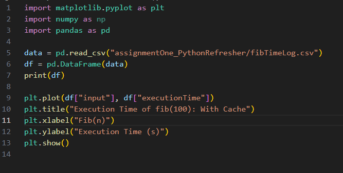
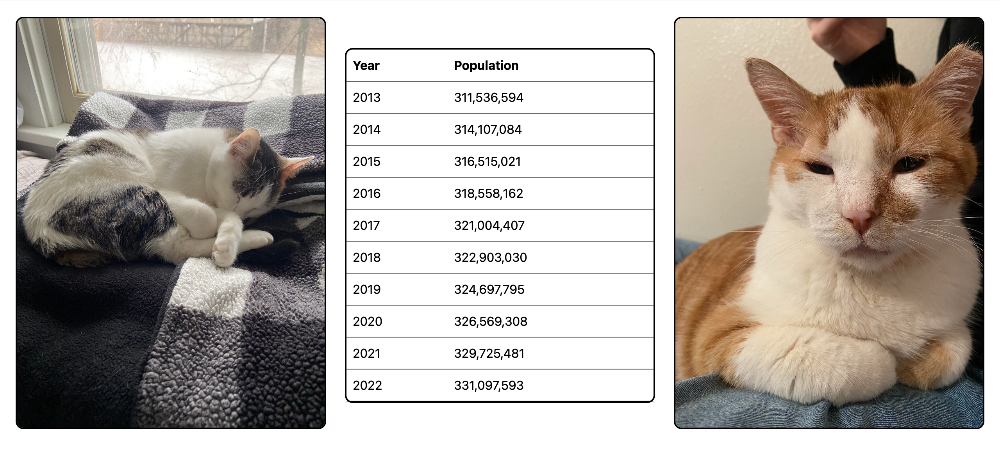

# cs3980-2025
 Repo For cs3980

# Table of Contents:
- ## classExercises
    - Scripts and code from in class demonstrations
- ## assignmentOne:PythonRefresher
    - First homework assignment. Contains the following files:
        - .py files:
            - echo.py - Contains first method described in homework.
            
            - fib.py - Contains the specified recursive definition of computing nth fibonacci number, and three decorators.
             
                1. @lru_cache:The lru_cache decorator from the functools module is used to cache the results of the function it decorates.
                2. @timer:The timer decorator measures and prints the execution time of the function it decorates. It wraps the function call, records the start and end times, calculates the time difference, and prints the result along with the execution time.
                3. @time_logger:The time_logger decorator logs the execution time of the function it decorates to a CSV file. It creates a CSV file with the function's name followed by TimeLog.csv, writes the headers, and appends the input arguments and execution time for each function call. This is used to plot the image
            - executionPlot.py - Contains the simple pyplot commands to generate a plot of the execution time of the nth fibonacci sequence. 
            
        - .csv file: 
            - The fibTimeLog.csv file is the logged execution time that is generated each time a function is run using the time_logger decorator. It is dynamically named based on the function it wraps. 
        - .png file: 
            - The png file is the plot generated by running the executionPlot.py. 
            
            - The axes of the image are labeled, with the Y representing the execution time in seconds, and the x representing the nth fibonacci number. 
            - The graph generated here varies quite disctinctly from the graph in the assignment, and from what I can discern, this has to do with every odd numbered fibonacci number being cached via the use of the @lru_cache decorator. I was not able despite many efforts to exactly replicate the graph shown by the professor. If I omitted odd numbered fib numbers from the graph it would look extremely similar to the provided example.  

- ## assignmentTwo:API_JSON_HTML_JavaScript
    - Second homework assignment. A simple web application that displays US Census data.
    - Contains the following files:
        - HTML/JavaScript files:
            - index.html - Contains the structure for the webpage with a responsive Bootstrap layout featuring two images and a central data table.
            - main.js - Handles the API call to the DataUSA Census endpoint and dynamically populates the table with formatted population data.
        - assets folder:
            - Contains images used in the webpage layout
        - Features:
            - Fetches and displays US population data from 2013-2022
            - Numbers formatted with thousands separators for readability
            - Responsive Bootstrap layout with bordered table and images
            - Data sorted chronologically from oldest to newest
        

