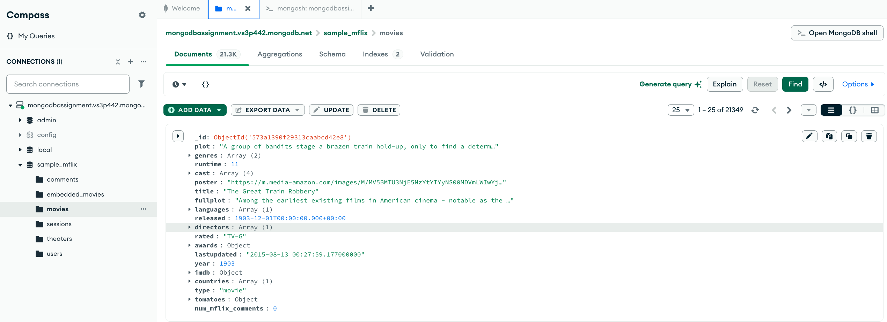
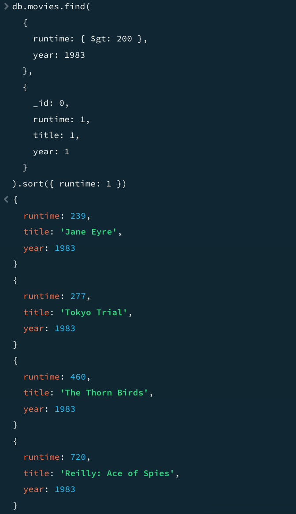
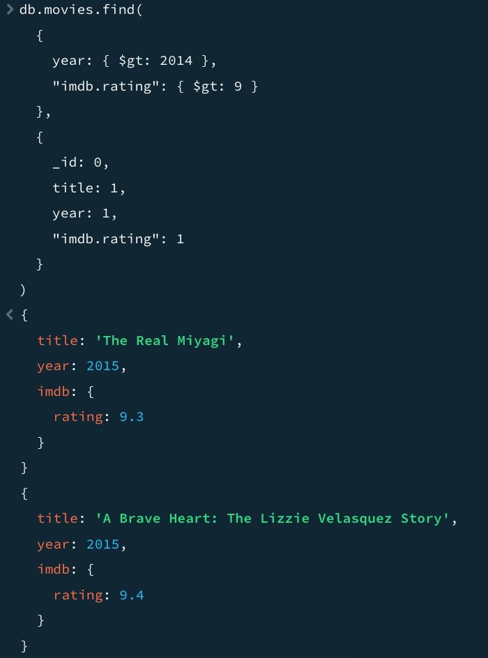

# MongoDB Compass Queries Documentation

## 1. Compass Connection

-   Successfully connected to MongoDB Compass and accessed the sample_mflix database
-   Viewed the movies collection which contains movie data
-   Collection contains 21.3K documents with movie information including fields like title, runtime, year, imdb ratings, etc.



## 2. Query 1: Movies with Runtime > 200 minutes (1983)

### Query:

```javascript
db.movies
    .find(
        {
            runtime: { $gt: 200 },
            year: 1983,
        },
        {
            _id: 0,
            runtime: 1,
            title: 1,
            year: 1,
        }
    )
    .sort({ runtime: 1 });
```



### Results:

Found 4 movies matching the criteria, sorted by ascending runtime:

1. "Jane Eyre" (Runtime: 239 minutes, Year: 1983)
2. "Tokyo Trial" (Runtime: 277 minutes, Year: 1983)
3. "The Thorn Birds" (Runtime: 460 minutes, Year: 1983)
4. "Reilly: Ace of Spies" (Runtime: 720 minutes, Year: 1983)

## 3. Query 2: Movies after 2014 with IMDB Rating > 9

### Query:

```javascript
db.movies.find(
    {
        year: { $gt: 2014 },
        "imdb.rating": { $gt: 9 },
    },
    {
        _id: 0,
        title: 1,
        year: 1,
        "imdb.rating": 1,
    }
);
```



### Results:

Found 2 movies matching the criteria:

1. "The Real Miyagi" (Year: 2015, IMDB Rating: 9.3)
2. "A Brave Heart: The Lizzie Velasquez Story" (Year: 2015, IMDB Rating: 9.4)
