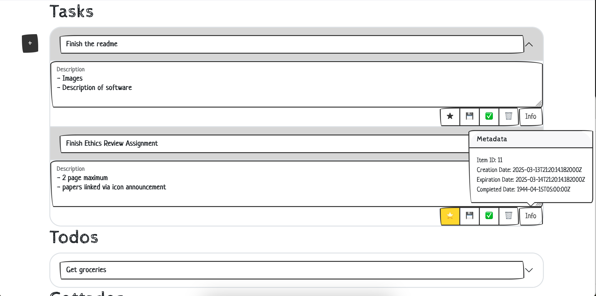

# GottaDo App

A simple web application for managing tasks, todos, and gottados using FastAPI and JavaScript.

## Motivation

I was motivated to expand on the idea of a personal task application and adapt it to the system I already use day to day. Tasks are to be completed within 24 hours, todos are completed within a week, and gottados are completed within a month. For the final project, in addition to the requirements (such as persistence via a database) I also intend to add other features to serve my real-life use case:

-   Calendar Integration
-   Filtering
-   Tags/Search by tags
-   UI for re-assigning 'expired' tasks
-   Order based on priority/pinning system
-   Markdown in the descriptions
-   Integration to IPhone homescreen via shortcuts functionality/sideloaded application
-   Task revival/task history
-   Recurring tasks
    -Overall UI enhancements/drag and drop

## Table of Contents:

-   ## Image Gallery

    -   Main Overview
        

    -   Create a task
        

    -   Details
        

    -   System alerts user upon state change
        

-   ## Backend
    -   FastAPI server implementing CRUD operations for managing tasks.
    -   Contains the following files:
        -   `main.py` - Entry point for the FastAPI server, initializing the application and including routes.
        -   `GottaDo.py` - Core logic for managing tasks, including data structures and operations.
        -   `GottaDo_routes.py` - Defines API endpoints for handling tasks and interacting with the frontend.
-   ## Frontend
    -   Simple JavaScript and HTML interface for interacting with the backend.
    -   Contains the following files:
        -   `index.html` - Main HTML file for displaying the UI and structuring the webpage.
        -   `main.js` - Handles the logic for interacting with the API, making HTTP requests, and updating the UI dynamically.
-   ## Features

    -   Create, Read, Update, and Delete (CRUD) operations for managing tasks.
    -   Categorization of tasks into "Tasks," "Todos," and "Gottados."
    -   High-priority task toggle.
    -   Bootstrap-powered responsive UI with modals for task entry.
    -   Dynamic front-end updates without requiring a full page reload.

-   ## Endpoints
    -   `GET /all`
    -   `GET /tasks`
    -   `GET /todos`
    -   `GET /gottados`
    -   `GET /completed`
    -   `POST /create`
    -   `DELETE /{id}`
    -   `PATCH /title/{id}`
    -   `PATCH /desc/{id}`
    -   `PATCH /expired_date/{id}`
    -   `PATCH /completed_date/{id}`
    -   `PATCH /high_priority/{id}`
    -   `PATCH /completed/{id}`
    -   `PATCH /level/{id}`
